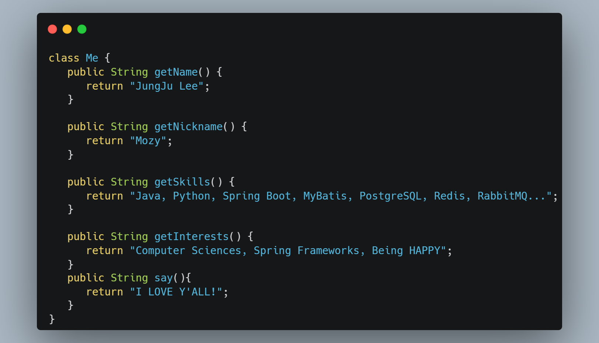

- 👋 Hi, I’m JungJu 'mozy' Lee
- 🔭 I’m currently working for ...
- 🌱 I’m currently learning ...
    - Spring Boot
    - Redis
    - RabbitMQ
- 📫 Contact  
 

    
<!---
mozylee/mozylee is a ✨ special ✨ repository because its `README.md` (this file) appears on your GitHub profile.
You can click the Preview link to take a look at your changes.
--->
--- 
- 👨‍💻 I’m interested in solving algorithms problems
    - Currently I like to solve problems at [BOJ](https://www.acmicpc.net/) and [Programmers](https://programmers.co.kr/)
    - I usually use Java and Python to solve algorithms problems
    - You can see it below

    
    

